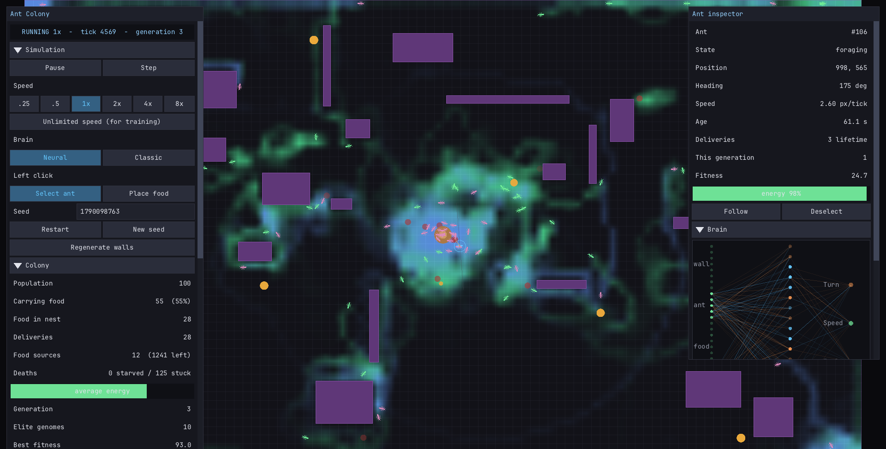

# Ant Colony Simulator

A real-time ant colony simulation in C11 and SDL2. Ants forage with evolved
neural-network brains, communicate through pheromone trails, and navigate a
randomly generated obstacle field. The interface is a panel-based control
room: live statistics, graphs, tunable parameters, and an inspector that
shows the selected ant's brain as it makes each decision.



## Build and run

Needs CMake 3.16+ and a C11 compiler. SDL2, microui and stb_truetype are
downloaded and built automatically by CMake, so nothing has to be installed
first.

```sh
cmake -S . -B build -DCMAKE_BUILD_TYPE=Release
cmake --build build
./build/ant_simulator
```

The first configure clones and builds SDL2, which takes a few minutes; later
builds are fast. To build only the simulation (no window, no SDL download):

```sh
cmake -S . -B build -DANTSIM_BUILD_APP=OFF
cmake --build build
ctest --test-dir build --output-on-failure
```

## Controls

Left-drag selects an ant (or drops food, with the Place food tool or Shift).
Right-drag pans, the wheel zooms.

| Key | Action | Key | Action |
| --- | --- | --- | --- |
| `Space` | Pause / resume | `P` | Pheromone trails |
| `→` | Step one tick | `O` | Danger pheromone |
| `,` `.` | Slower / faster | `G` | Grid |
| `/` | Unlimited speed | `K` | Death markers |
| `R` | Restart, same seed | `V` | Vision rays |
| `T` | Restart, new seed | `B` | Neural / classic brain |
| `M` | Regenerate walls | `1` `2` | Select / place-food tool |
| `Tab` | Show / hide panels | `F` | Follow selected ant |
| `H` | Fit world to window | `F11` | Fullscreen |
| `Esc` | Deselect, then quit | `Q` | Quit |

Every shortcut is listed in the panel's Shortcuts section, generated from the
same table the keyboard uses ([src/app/input.c](src/app/input.c)).

## How the simulation works

**Ants** run a two-state machine: foraging (looking for food, laying a HOME
trail) and returning (carrying food, laying a FOOD trail). Each tick an ant
senses, steers, moves, and interacts:

- **Vision**: 7 rays across a 180° arc report how close the nearest wall, ant
  and food source are.
- **Brain**: those 21 values plus 6 state inputs (pheromone ahead, distance
  and bearing to the nest, carrying, energy) feed a 27 → 16 → 3 network whose
  outputs are turn, speed and an urge to explore. The *classic* brain is a
  hand-written trail follower, useful as a baseline to compare against.
- **Energy** drains every tick and is topped up by delivering food, so an ant
  that never finds food eventually starves. An ant that stops making progress
  for five checks in a row dies as well, and both deaths leave a danger
  pheromone behind.

**Evolution** is generational. Every ant that dies, and every ant still alive
when a generation ends, is scored on deliveries and survival. The best genomes
become the parents of the next generation, and the weakest living ants are
replaced by their children. Previous elites re-enter the pool at a decayed
score, so one bad generation cannot wipe out a good brain.

**Pheromones** live on a grid of 20px cells with three layers (food trail,
home trail, danger), each evaporating a little every tick.

## Layout

```
src/core/     the simulation: no SDL, no rendering, no input
  world.c       world lifetime, the step function, stats and events
  ant.c         sense, steer, move, pick up, deliver
  vision.c      ray casting against ants, food and walls
  neural_net.c  forward pass, crossover, mutation
  evolution.c   elite selection and breeding
  pheromone.c   the three pheromone grids
  walls.c       obstacles, broadphase, collision, ray casts
  spatial_hash.c uniform grid rebuilt each tick
  sim_config.c  runtime-tunable parameters and their limits
src/render/   SDL drawing: camera, sprite batching, glyph atlas
src/ui/       microui setup and the panels
src/app/      window, main loop, input, and the headless runner
tests/        core tests, run by ctest
archive/      the original Python/pygame version (not maintained)
```

The core links without SDL. That is what lets `antsim_headless` run the same
simulation with no window, and the tests run it with no graphics at all:

```sh
./build/antsim_headless --ants 500 --ticks 20000 --report 2000
./build/antsim_headless --ants 500 --ticks 2000 --bench      # timing only
```

A world replays exactly given the same seed and configuration: each world owns
its random stream, so two worlds stepped side by side stay identical.

## Performance

Measured with `antsim_headless --bench` on this machine (Release, 1920x1080
world, neural brains):

| Ants | Before the refactor | Now |
| --- | --- | --- |
| 100 | 3,807 ticks/s | 7,634 ticks/s |
| 500 | 206 ticks/s | 458 ticks/s |

Vision dominates the remaining cost: with the classic brain, which casts no
rays, 500 ants run at about 20,000 ticks/s. Ants are found through a spatial
grid rather than an all-pairs scan, walls use a broadphase grid, and the
renderer draws all ants in a single batched call with pheromones uploaded as
one small texture.

The simulation runs on a fixed 60 tick/s clock independent of the frame rate,
with a work budget per frame, so heavy settings slow the simulation instead of
freezing the window.

## Tuning

Everything in the Parameters section is live except the world size and food
setup, which apply on restart. Useful things to try:

- Turn the generation length down and the replacement fraction up to evolve
  faster; watch the fitness graphs.
- Press `/` for unlimited speed to train for a while, then drop back to 1x.
- Switch to the classic brain to see what hand-written trail following looks
  like next to an evolved one.
